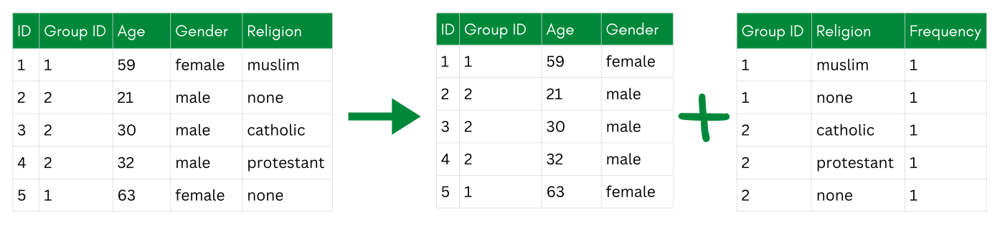

::: {.callout-tip collapse="true"}
## Learning Objective

-   After completing this part of the tutorial, you will understand the fundamental principles of anonymization techniques and how they relate to one another.
:::

Anonymization transforms data so that **individuals can no longer be identified**, while keeping the data useful for analysis. The challenge is always a trade-off: stronger anonymization means better privacy protection, but it can also mean less detailed or less useful data. Finding the right balance is the core problem we will deal with throughout this tutorial.

In the next sections of the tutorial, I will present you with several groups of techniques for anonymization, following the taxonomy by @Carvalho2023_SurveyPrivacyPreservingTechniques.

-   **Non-perturbative techniques** are those that do not change data values but rather mask them.  *An example of a non-perturbative technique (i.e., cell suppression)*

-   **Perturbative techniques** involve modifying data values to anonymize the data.  *An example of a perturbative technique (i.e., additive noise)*

-   **De-associative techniques** separate indirectly identifying parts of the data from the sensitive parts.  *An example of a de-associative technique (i.e., anatomization)*

-   **Synthesizing data** means creating new data with the same statistical properties as the original data. I will not discuss this method in detail in this tutorial.  *An example of synthetic data*

Each family of techniques addresses different types of risk. **Non-perturbative techniques** primarily reduce **identity disclosure** risk by making individuals less unique in the dataset - for example, by grouping age values into broader categories. **Perturbative techniques** protect against both **identity and attribute disclosure** because they change the actual data values: Even if someone is identified, the other values may no longer be accurate. **De-associative techniques** break the link between identifiers and sensitive attributes, making it harder to connect a person to all data within the dataset. **Synthetic data sidesteps disclosure risk** entirely by generating completely new records that were never tied to real individuals.

For each anonymization technique, the **variable's scale level** needs to be taken into account. Some techniques only work for categorical variables (i.e., discrete variables; e.g., gender, highest level of education), others only for continuous variables (e.g., income, age), and some work for both. Make sure to check each technique's requirements before applying it to your data.

In the following chapters, we will go through each family of techniques one by one. I will first explain the underlying idea of a family and will then provide hands-on exercises for selected techniques using the same simulated dataset from [the chapter on personal data](../1_FOUNDATION/1_3_Personal_Data) and the `sdcMicro` package. This way, you can see how each technique changes the data and its risk profile step by step.

After learning more about these techniques in the following chapters, I will explain how to decide which technique is the best for your data in the [the chapter on choosing the right technique](../2_7_Choosing_technique).

#### Resources, Links, Examples

@Carvalho2023_SurveyPrivacyPreservingTechniques for detailed information

# References
