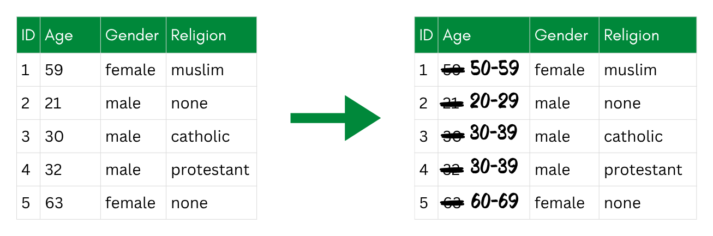
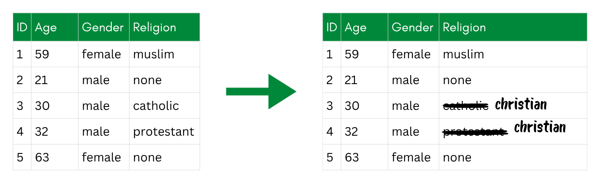
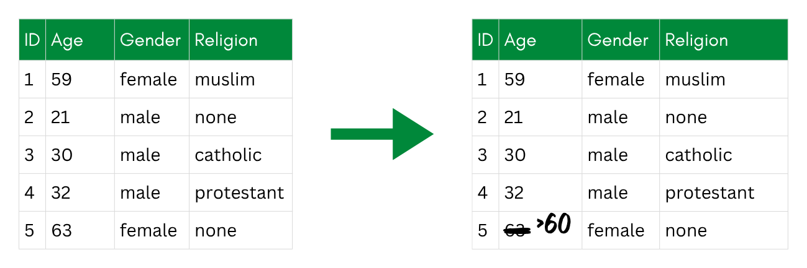
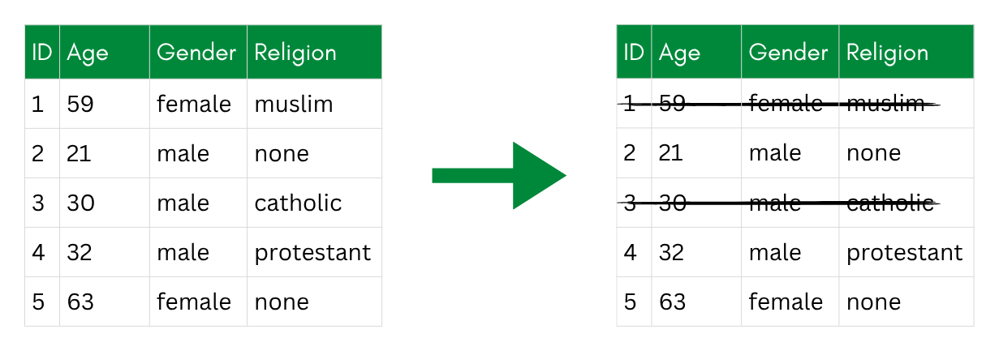

::: {.callout-tip collapse="true"}
## Learning Objective

After completing this part of the tutorial, you will be able to

-   choose an appropriate non-perturbative technique.
-   apply simple non-perturbative techniques.
:::

```{r Setup}
#| include: false

# Setup: load packages and data, then create the sdcObject
library(sdcMicro)
library(tidyverse)

data_withoutdirectidentifiers <- read.csv(here::here("SimulatedData_noidentifiers.csv")) # Change based on the location of your data file

sdc_data <- createSdcObj(
  dat     = data_withoutdirectidentifiers,
  keyVars = c("gender", "age", "education", "plz"),
  numVars = c("income", "years_in_job")
)
```

Non-perturbative techniques reduce re-identification risk **without distorting the underlying values**—they either remove information or make it less specific. What stays in the dataset is still true; there is just **less** of it. This is what sets them apart from perturbative techniques, which add noise or swap values to obscure the original data.

Non-perturbative techniques include all techniques referred to as data masking, suppression, and deletion.

Non-perturbative techniques are usually the **right starting point**. They are easy to explain, easy to document, and easy to verify. For many research datasets, they are enough on their own.

Depending on the specific data type and risk, different techniques are possible [@Carvalho2023_SurveyPrivacyPreservingTechniques]:

# Examples of Non-Perturbative Techniques

## Global Recoding

Global recoding (also called generalization) replaces the exact values of a variable with **broader categories**—applied to **every row** in the dataset.

{fig-alt="A before-and-after table of five records; the exact ages are replaced with age bands such as 50-59 and 20-29, while the other columns stay the same."}

**Examples**

-   Replacing specific countries with world regions (e.g., "Germany", "France" → "Western Europe").

-   Recoding age in year to age in decade.

The key decision is how broadly to generalize. Wider categories reduce risk more, but also lose more information. The right granularity depends on how many people share each combination—which is exactly what k-anonymity measures. You will practice this trade-off in the exercise below.

## Local Recoding

Local recoding **generalizes values only where needed**, rather than across the whole dataset. This is useful when only a small subset of values is rare enough to create risk.

**Example**: If only few participant are from Asia, you may recode only their values (e.g., "China", "India", "Nepal") to "Asia", keeping all others unchanged.

{fig-alt="A before-and-after table where only two of the five records have their religion changed to christian; the other records are unchanged."}

This means, that values are on different level (in this example: country vs. continent). Compared to global recoding, local recoding is more targeted and loses less information, but it can be harder to justify and document consistently—you need to be transparent about which categories were collapsed and why.

## Top-and-Bottom Coding

Top-and-bottom coding is a special case of **recoding that applies to numerical variables**. Instead of grouping all values into bands, you **cap the extreme ends of the distribution**—replacing any value above a threshold with that threshold (top coding), or below it (bottom coding). This is useful when the bulk of your data is unremarkable, but a few unusual values are risky because they belong to a small number of people. In our dataset, very high incomes might apply to only one or two participants, making them easy to single out. Capping income at the 95th percentile, for example, means the highest earners all share the same reported value. Top-coding is a non-perturbative method because the exact value is only replaced with a coarser but still truthful one—no value is distorted, it is merely made less precise.

{fig-alt="A before-and-after table where the largest age value is replaced with a >60 cap; the other ages are unchanged."}

**Examples**

-   Instead of reporting "6 children", report "4+ children" for anyone above this threshold.

-   All participants below the age of 20 years are coded as "\<20 years".

How to determine the threshold: A common approach is to look at the distribution of the variable and choose a threshold where the remaining values above (or below) it are too few to guarantee anonymity. For example, if only 3 people in your dataset are older than 80, you might top-code at 80. You can also use percentiles—capping at the 95th or 99th percentile is a common starting point. The right threshold depends on your data and the level of k-anonymity you want to achieve.

## Suppression

Suppression means **removing information entirely**—replacing a value with a missing value (`NA`) or dropping it altogether. This is also known as nulling. It is the most straightforward way to handle data that is too risky to release, but it also loses the most information.

{fig-alt="A before-and-after table where every value in the Gender column is replaced with NA, while the other columns are kept."}

Suppression can occur on different levels:

-   **Cell suppression**: Remove a single risky value while keeping the rest of the record. For example, if one participant has a unique job title that makes them identifiable, you can set only that cell to `NA`.

-   **Record suppression**: Remove an entire participant's data if their combination of attributes is so unique that no other technique can adequately protect them.

-   **Variable suppression**: Drop a whole variable from the released dataset if it is too risky to include at all. Direct identifiers like name and email address are a clear case—we already did this in [the chapter on personal data](../1_FOUNDATION/1_3_Personal_Data).

**Example**: Replacing credit card number values with XXX. In the credit card example, the application of the character masking technique can be *partial*, hence only the first 9 numbers are replaced. Further, the overall number of characters stays the same, hence: XXXX XXXX XXXX 1234.

Suppression is often used as a last resort after recoding: if recoding alone is not enough to bring all records up to the required k-anonymity threshold, targeted cell suppression can close the remaining gaps.

## Sampling

If your dataset covers an entire population—for example, all students enrolled in a particular program, or all employees of a specific company—then releasing it in full means that anyone who knows a person was part of that group can try to find their record. [Participation knowledge](../1_FOUNDATION/1_5_Privacy_Concepts#participation-knowledge) would then be a given if the recruitment strategy is known. Releasing only a random sample of the data breaks this assumption: an attacker can no longer be certain whether a given individual is even in the released dataset.

{fig-alt="A before-and-after table where two of the five rows are struck through to show they are not included in the released sample."}

A sample can be randomly selected, but also based on conditions (e.g., quotas for study subjects).

Sampling is most relevant for administrative datasets and registers. For typical survey-based research, where participation is voluntary and not exhaustively documented, it is less commonly needed. If you do use it, keep in mind that the sample size affects both privacy and the statistical representativeness of the data.

# Pro and Contra Using Non-Perturbative Techniques

Pros:

-   original data values are preserved (no distortion of statistics within remaining cells)
-   straightforward to implement and explain
-   easy to document

Cons:

-   information is lost (removed or coarsened)
-   heavy suppression can make the dataset hard to use
-   may not be sufficient on its own for high-risk data

# Exercise: Applying Non-Perturbative Techniques

In this exercise, you will apply non-perturbative techniques to the data to reduce re-identification risk.

The following `sdcMicro` functions are available to you:

-   `globalRecode()` recodes a key variable into broader groups (e.g., exact age → age band)
-   `topBotCoding()` caps extreme values at a given threshold
-   `localSuppression()` suppresses individual cells in records that fall below a chosen k-anonymity threshold. I would be careful when using this function: It does a good job at finding individuals whose record is still unique, but applies cell suppression (i.e., deleting datapoints). This is more of a last resort. You see a summary of the last suppression step in the summary of the `sdcObject`.

In addition, you can recode data manually, e.g., by using `mutate`, or by using a function such as `fct_lump_min()` from the R pakage `forcats`. This function lumps all categories below a certain group size together.

1.  Look at the key variables in `sdc_data` (`gender`, `age`, `education`, `plz`) and decide which technique is appropriate for each. There is no single correct solution—choose thresholds and groupings that make sense given the data, and be prepared to justify your choices.
2.  Apply these techniques using the functions mentioned above.
3.  Compare the new risk summary to the one from the previous exercise.

::: {.callout-tip collapse="false"}
The `sdcMicro` functions operate directly on the `sdc` object and update risk estimates automatically. Check `?globalRecode`, `?topBotCoding`, and `?localSuppression` for argument details.

All manual changes as with`forcat` functions like `fct_lump_min()` are applied to the dataset itself. The `sdcObject` needs to be updated afterward.
:::

::: {.callout-important collapse="true"}
## Solution

Keep in mind that this is just an example solution—there are many ways to achieve similar levels of privacy.

I started by applying **global recoding to age**:

```{r}
# Global recoding: bin age into roughly 10-year bands
sdc_nonpert <- globalRecode(
  obj    = sdc_data,
  column = "age",
  breaks = c(17, 29, 39, 49, 59, Inf), # Define breaks
  labels = c("18-29", "30-39", "40-49", "50-59", "60+")
)

sdc_nonpert # check summary after making the change
print(sdc_nonpert, type = "risk") # check risk after making the change

```

I started by dividing the age into five about 10-year breaks. This provides a mean of 40 persons per age break, while the smallest one still has 23. These breaks can be changed later if more privacy or more utility is needed.

We see that k-anonymity values have not been influenced by the recoding of age so far—this is primarily due to the `plz` variable that is unique for most participants. I therefore decided to **generalize the postal code**.

As a first step, I used `globalRecode()` to group postal codes into five broad regions:

```{r}
# Global recoding: group postal codes into five broad regions
sdc_nonpert <- globalRecode(
  obj    = sdc_nonpert,
  column = "plz",
  breaks = c(0, 19999, 39999, 59999, 79999, 99999),
  labels = c('00-19', '20-39', '40-59', '60-79', '80-99')
)

sdc_nonpert
print(sdc_nonpert, type = "risk")
```

The new categories map loosely to north-east (00-19), north-central (20-39), west (40-59), south-west (60-79), and south-east (80-99) Germany.

Looking at k-anonymity now, we see that there are still many unique observations. To reduce risk further, I will generalize `plz` even more. For this dataset, I mostly want to use `plz` to distinguish whether participants live in the Munich area or elsewhere in Germany. Postal codes starting with 8 cover roughly the areas surrounding Munich, so I will collapse `plz` into just two categories: `"8xxxx"` and `"other"`.

`globalRecode()` cannot do this directly since `cut()` only handles continuous intervals—and "other" spans two separate ranges (00000-79999 and 90000-99999). Instead, I directly modify the data stored with the `@manipKeyVars` slot of the `sdcObject` and recalculate risks:

```{r}
# Collapse postal codes into Munich area (8xxxx) vs. other
library(forcats)

sdc_nonpert@manipKeyVars$plz <- fct_collapse(
  sdc_nonpert@manipKeyVars$plz,
  "8xxxx" = c("80-99"),
  "other" = c("00-19", "20-39", "40-59", "60-79")
)

sdc_nonpert <- calcRisks(sdc_nonpert) # After these manual changes, you have to update the risks on the sdcObject

sdc_nonpert
print(sdc_nonpert, type = "risk")
```

Currently, we are at only 32 unique persons in our dataset and 60 persons that violate 2-anonymity. This corresponds to the "Number of observations with higher risk than the main part of the data", as summarized as a risk measure in the output: Now, the majority of data confirm with 2-anonymity, but for 32 participants, the risk is still higher, as they are unique in the dataset. Previously, in the original data, the majority of participants were unique, meaning none were **especially** at risk (since all of them were at risk).

I don't want to generalize the `keyVars` any further, and for that reason, I decide to apply **local suppression**.

```{r}
# Local suppression to reach 2-anonymity
sdc_nonpert <- localSuppression(
  sdc_nonpert,
  k = 2, # define wanted k-anonymity level, k = 2 is the default
  importance = c(2, 1, 4, 3) # this defines the order of importance; the algorithm begins suppressing on the variable marked as 4
  )

sdc_nonpert
print(sdc_nonpert, type = "risk")
```

The summary of the `sdcObject` shows us what the last local suppression step has achieved: It suppressed 28 values on the education variable and 2 each on gender and postal code. Now, 2-anonymity is reached for all participants. 16 entries violate 3-anonymity; I will try local suppression at k = 3 to see how much more suppression would be necessary to achieve this.

```{r}
# Local suppression to reach 3-anonymity
sdc_nonpert <- localSuppression(
  sdc_nonpert,
  k = 3, # define wanted k-anonymity level, k = 2 is the default
  importance = c(2, 1, 4, 3) # this defines the order of importance; the algorithm begins suppressing on the variable marked as 4
  )

sdc_nonpert
print(sdc_nonpert, type = "risk")
```

With 12 more suppressions on education and 4 on gender, we can achieve 3-anonymity. Only 29 entries remain, that violate 5-anonymity. To me, this is enough protection on k-anonymity, while still preserving most of utility, especially on the most interesting variables.
:::

# Further Anonymization Steps Using Perturbative Techniques

Now that the categorical key variables are in their final state, I applied **top-coding** to the continuous key variables income and years in job.

My goal with income is to protect the few individuals with a very high income. I start by inspecting the distribution:

```{r}
# Inspect the income distribution
library(ggplot2)

ggplot(data_withoutdirectidentifiers, aes(y = income)) +
  geom_boxplot() +
  theme_minimal()
```

I see a few extreme outliers above 400 000 €. Choosing the 95th percentile at `r quantile(data_withoutdirectidentifiers$income, 0.95)`€ cuts these off. I'll use `topBotCoding()` and set the value at the 95th percentile, replacing those values with that one.

```{r}
# Top-code income at the 95th percentile
sdc_nonpert <- topBotCoding(
  obj         = sdc_nonpert,
  column      = "income",
  value       = quantile(data_withoutdirectidentifiers$income, 0.95),
  replacement = quantile(data_withoutdirectidentifiers$income, 0.95),
  kind        = "top"
)

sdc_nonpert
print(sdc_nonpert, type = "risk")
```

For **years in job**, I start by familiarizing myself with the data:

```{r}
# Inspect the years_in_job distribution
summary(data_withoutdirectidentifiers$years_in_job)

ggplot(data_withoutdirectidentifiers, aes(y = years_in_job)) +
  geom_boxplot() +
  theme_minimal()
```

Based on the visualization, I decide to use 15 as a cut-off value, as this cuts off the extreme values.

```{r}
# Top-code years_in_job at 15
sdc_nonpert <- topBotCoding(
  obj         = sdc_nonpert,
  column      = "years_in_job",
  value       = 15,
  replacement = 15,
  kind        = "top"
)

sdc_nonpert
print(sdc_nonpert, type = "risk")
```

These techniques reduce the disclosure risk to up to 92% compared to the original data.

Finally, I save the `sdcObject`.

```{r}
# Save the sdcObject for the next chapter
saveRDS(sdc_nonpert, here::here("sdc_nonpert.rds"))
```

# References
