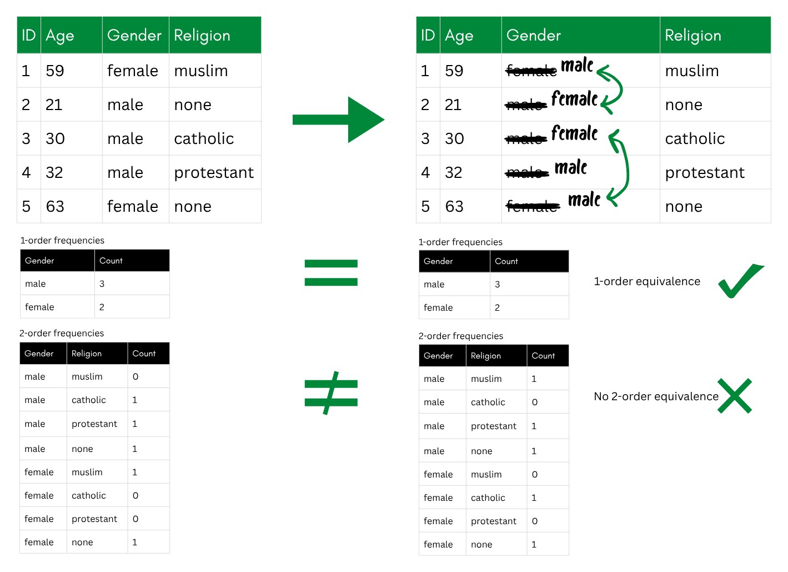
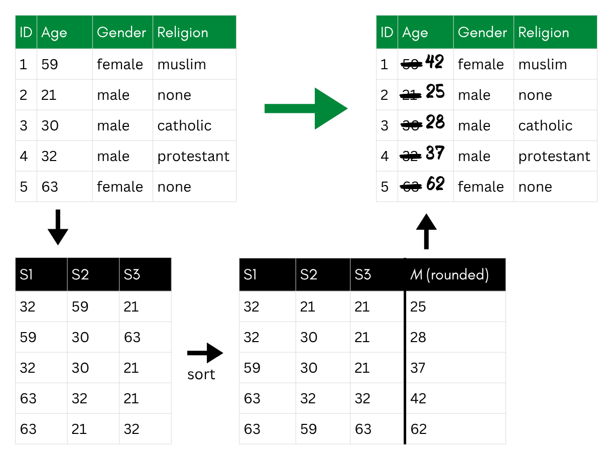
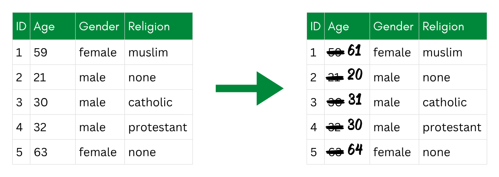
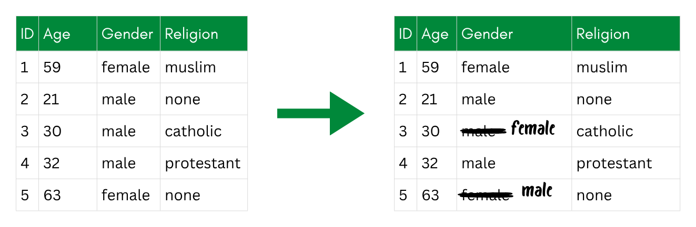

::: {.callout-tip collapse="true"}
## Learning Objective

-   After completing this part of the tutorial, you will be able to apply selected perturbative techniques in R.
:::

```{r Setup}
#| include: false

# Setup: load packages, data, and the saved sdcObject
library(sdcMicro)
library(tidyverse)

data_withoutidentifiers <- read.csv(here::here("SimulatedData_noidentifiers.csv")) # Change based on the location of your data file

sdc_nonpert <- readRDS(here::here("sdc_nonpert.rds")) # Change based on the location of your Sdc-object file
```

The core idea behind perturbative techniques is to introduce **controlled changes to data values**. Unlike non-perturbative techniques that hide or remove information, perturbative methods keep all records and variables in the dataset but **alter the values themselves**. The key requirement is that the changes should be large enough to prevent re-identification but small enough that the overall statistical properties of the data (means, variances, correlations) are preserved.

In general, perturbation does not increase k-anonymity<!-- TODO Explain this -->. Rather, it adds another layer of protection, especially to continuous variables.

In this chapter, I will present a few perturbative techniques introduced in @Carvalho2023_SurveyPrivacyPreservingTechniques.

# Examples of Perturbative Techniques

## Swapping

Swapping **exchanges values of a variable between participants**. Instead of altering the values themselves, it breaks the link between a record and the individual it belongs to.

There are two main variants. **Record swapping** (also known as data swapping) applies to categorical variables: values like gender or country of residence are swapped between records. A useful property here is t-order equivalence. For example, 1-order equivalence means the marginal frequencies are preserved (same number of males and females as before), and 2-order equivalence means joint frequencies are also preserved (same number of males and females from each country).

{fig-alt="A before-and-after table where gender values are swapped between records; frequency tables below show that 1-order frequencies stay equal while 2-order frequencies change."}

**Rank swapping** applies to continuous variables: values are only swapped with other values that are close in rank, which limits how much the distribution is distorted.

The main **advantage** of swapping is that it removes the relationship between a record and the individual without introducing new values that never existed in the data. It can protect rare and unique values and works across variable types. On the **downside**, non-random swapping requires careful implementation, and swapping can produce unusual combinations of values that did not exist in the original data. It is also not effective against membership disclosure—an attacker who does not need to identify a specific record but just wants to learn something about a group will not be deterred.<!--which is better then? cite?-->

## Re-sampling

Re-sampling **replaces original values with averages** computed from bootstrap samples [@hundepool2026]. You draw multiple independent bootstrap samples from the original data with replacement, with the same sample size as your original data, and sort the values within each sample. You then compute the average of the smallest values across all samples, then of the second-smallest ones, and so forth, and replace the corresponding original values (i.e., the smallest original value with the average of the smallest values in the samples, etc.). The result preserves the overall distribution, but individual values no longer correspond to real observations.

{fig-alt="A before-and-after table where the exact ages are replaced with mean values of sub-samples."}

## Noise

Noise addition (also known as randomization) **adds a random value** to each original value. The most common form is **additive noise**: a random draw from a distribution (typically normal with mean 0) is added to the original value. **Multiplicative noise** works similarly but multiplies the original value by a random factor, which scales the perturbation to the magnitude of the variable.

The noise can be uncorrelated—each value gets an independent random draw—or correlated with the original values, which better preserves the correlation structure between variables. Transformations of the variable (e.g., log-transforming income before adding noise) are also possible and can improve the result for skewed distributions.

{fig-alt="A before-and-after table where each age is replaced with a slightly different, noisy value."}

::: {.callout-note collapse="false"}
## Differential Privacy

<!--TODO Improve this-->

Differential privacy is a **formal privacy guarantee** that is usually implemented through noise addition. The idea is that the output of any analysis should be essentially the same whether or not any single individual is included in the dataset—so the presence or absence of one person cannot be inferred from the result.

In practice, this means adding carefully calibrated noise to query results or to the data itself, such that any individual's contribution is hidden within the noise.

For example, in a dataset with medical data and tests on HIV, even if the attacker already suspects a person X is the only possible HIV case in the dataset, the data does then not confirm or deny that suspicion.<!-- how?-->

For R users, the `diffpriv` package implements differential privacy mechanisms and is a good starting point for exploring this approach [@rubinstein2017].
:::

## Microaggregation

Microaggregation **groups records by similarity on the variable of interest and replaces each value with a group aggregate**—usually the mean or median. Records within the same group end up sharing the same value, which makes it impossible to single out an individual based on that variable alone.

{fig-alt="A before-and-after table where ages are replaced with group averages, with several records sharing the same value."}

The quality of the result depends on how homogeneous the groups are: the more similar the original values within a group, the less information is lost when replacing them with the group mean. This is why the grouping algorithm matters. The default in `sdcMicro`, `mdav` (Maximum Distance to Average Vector), tries to form compact groups to minimize distortion.

## Rounding

**Rounding replaces exact values with rounded versions**. For example, one can round income to the nearest €1,000, or age to the nearest 5 years. It is the simplest perturbative technique and is easy to explain and verify. The downside is that it provides relatively weak protection on its own, since the original value can often be guessed within a small range, or looses quite a lot of data in case of larger ranges that are rounded to the same value.

{fig-alt="A before-and-after table where ages are rounded to values such as 60, 20 and 30."}

## PRAM

PRAM (Post RAndomisation Method) applies to categorical variables. Each value is **randomly recoded to a different category with a certain probability** defined in a transition matrix. For example, a participant recorded as "male" might be recoded to "female" with probability 0.05 and kept as "male" with probability 0.95. The transition probabilities are chosen so that the distribution of the variable is approximately preserved, even though individual values may have changed.

{fig-alt="A before-and-after table where two of the gender values are randomly changed to a different category."}

This technique can be applied to the `keyVars` we defined in the `sdcObject` earlier, but does not improve k-anonymity indicators since it doesn't reduce the amount of unique combinations but rather changes the accuracy of those combinations. It is therefore an additional level of protection that `sdcMicro` indicators can not measure.

# Keeping Utility

After applying any perturbative technique, you should compare key statistics (means, standard deviations, correlations, regression coefficients) between the original and perturbed datasets. If the differences are small enough for your purposes, the perturbation has preserved utility. We cover formal utility measures in [the chapter on balancing utility and privacy](../3_PRIVACY_OPENNESS/3_1_Balancing).

# Pro and Contra of Using Perturbative Techniques

Pros:

-   No records or variables are removed; the dataset stays complete.
-   Statistical properties like means, variances, and correlations can be largely preserved
-   Easy to tune the privacy-utility trade-off by adjusting the noise level or group size.

Cons:

-   Individual values are no longer accurate. This makes perturbative techniques unsuitable if exact values matter—for example, if a researcher needs to verify that a specific participant had a specific income.
-   Risk of reverse-engineering: if the perturbation method and its parameters are known, an attacker may be able to approximately reconstruct the original values.
-   If applied too aggressively, perturbative techniques can distort subgroup statistics in ways that are hard to detect.

# Exercise: Applying Perturbative Techniques

Let's try out two common perturbative techniques: microaggregation and noise. Conveniently, both are available directly in `sdcMicro`.

Continue working with `sdc_nonpert` from the previous exercise.

1.  **Apply microaggregation** (with the function `microaggregation`) **to income** using the default method (`"mdav"`). Start with a group size of `aggr = 5`.

2.  **Add additive noise to income** (with the function `adddNoise)` as an alternative. Start with a noise parameter of 1 .

3.  **Compare the methods:** Which parameters do you need to achieve similar levels of protection?

::: {.callout-tip collapse="false"}
You cannot undo perturbation steps within the same `sdcObject`. Create a fresh copy of `sdc_nonpert` before trying the second method so you can compare them side-by-side.
:::

::: {.callout-important collapse="true"}
## Solution

### Microaggregation

I start by applying microaggreagation with a group size of 5 on a new `sdcObject`.

```{r}
# Microaggregation: replace income with group means (group size 5)
sdc_micro <- microaggregation(
  obj    = sdc_nonpert,
  variables = "income",
  aggr   =  5,          # group size
  method = "mdav"      # Maximum Distance to Average Vector
)

sdc_micro
print(sdc_micro, type = "risk")

data_micro <- extractManipData(sdc_micro) # Extract the manipulated data
```

`mdav` groups records by their distance to the group centroid, then replaces each value with the group mean. With `aggr = 5`, at least 5 records share the same income value, so singling out an individual is harder.

As we can see in the output of the `sdcObject`, the disclosure risk is reduced from up to 100% in the beginning to a range going only up to 77.5%.

### Additive noise

```{r}
# Additive noise on income
sdc_noise <- addNoise(
  obj    = sdc_nonpert,
  variables = "income",
  noise  = 3.5          # noise level as fraction of SD
)

print(sdc_noise, type = "risk")
sdc_noise
```

`addNoise` draws from a normal distribution with mean 0 and standard deviation = `noise × sd(income)` and adds it to each value. Every record gets a unique (slightly wrong) income. When `noise = 3.5`, we achieve a disclosure risk between 0% and 75.5%, instead of one between 0% and 100% that we started with.

Let's save these objects for now. We will later come back to inspect the utility of both methods in [the chapter on balancing utility and privacy](../3_PRIVACY_OPENNESS/3_1_Balancing).

```{r}
# Save the perturbed sdcObjects for the balancing chapter
saveRDS(sdc_micro, here::here("sdc_micro.rds"))
saveRDS(sdc_noise, here::here("sdc_noise.rds"))

```
:::

# References
