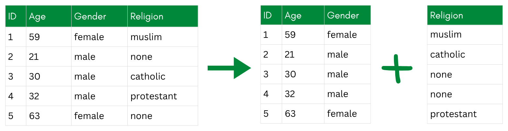
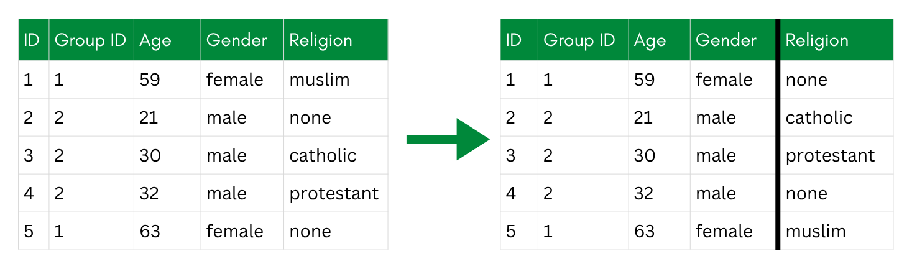
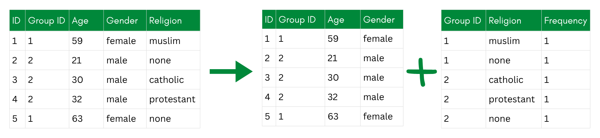
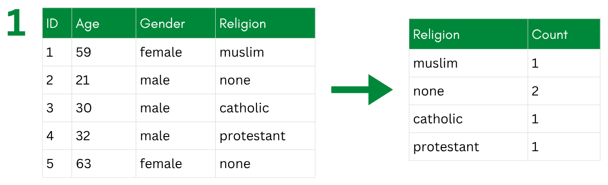
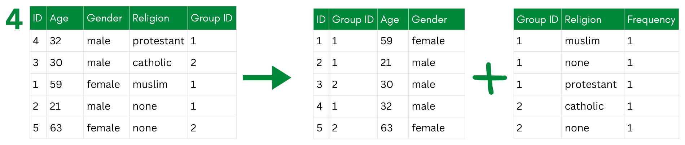

::: {.callout-tip collapse="true"}
## Learning Objectives

After completing this part of the tutorial, you will

- know selected de-associative techniques.
- apply anatomization as one de-associative technique in R.
:::

```{r Setup}
#| include: false

# Setup: load packages, data, and the saved sdcObject
library(sdcMicro)
library(tidyverse)
library(dplyr)

data_withoutidentifiers <- read.csv(here::here("SimulatedData_noidentifiers.csv")) # Change based on the location of your data file
```

De-associative techniques protect privacy by **breaking the link between indirect identifiers and sensitive variables,** rather than altering the values themselves. The underlying idea is that even if an attacker can identify a person's record based on their demographic attributes, they should not be able to learn their sensitive values from it.

The simplest version of this is just **separating a dataset into two tables—one with the identifiers and one with the sensitive attributes**, and randomizing the order of rows in one of them. The problem is that this makes it impossible to link any demographic context to the sensitive values, which severely limits what analyses can be done. It is more of a last resort than a practical technique for sharing research data.

{fig-alt="A diagram showing the original table split into an identifier table (ID, Age, Gender) and a separate Religion table (with randomized order of rows), with no link between the two."}

More useful are approaches that preserve some analytical structure while still breaking the individual-level link—the two main ones being bucketization and anatomization.

# Examples of De-Associative Techniques

## Bucketization

Bucketization groups records into "buckets" based on their indirect identifiers (like age, gender, or postal code), with each bucket required to contain at least k records to satisfy k-anonymity. Within each bucket, the sensitive values—such as income or political opinions—are randomly shuffled among the records. The result is that an attacker might be able to narrow someone down to a bucket, but cannot tell which sensitive value belongs to which specific person within it.

The process works in three steps:

1.  Generalize the indirect identifiers to create buckets.
2.  De-generalize the identifiers within each bucket back to their original values.
3.  Permute the sensitive values randomly within each bucket.

The shuffling in step 3 is what makes this a de-associative rather than a perturbative technique—the values themselves are unchanged, only the assignment between records and sensitive attributes is broken within each group.

{fig-alt="A multi-step diagram: the original table is generalized into age bands to form buckets with a Group ID, de-generalized back to original ages, and the Religion column is permuted within each group, marked by a bold vertical line."}

## Anatomization

Anatomization is a cleaner alternative to bucketization that improves the properties of the resulting deassociation. Rather than shuffling values within buckets, anatomization splits the dataset into two separate tables:

- A **quasi-identifier table** containing the indirect identifiers (e.g., age, gender, postal code), with a group ID linking each record to its group.
- A **sensitive table** containing the sensitive attributes and the same group ID, but with the individual record links removed. Instead of one row per person, it stores, for each group, how often each sensitive value occurs.

A researcher re-using the data can still answer questions like "what is the distribution of political opinions among 30-44 year olds in postal region 8xxxx?" by joining on the group ID. But they cannot link any specific row in the sensitive table back to a specific individual in the quasi-identifier table—the individual-level association is gone. Within a group, every sensitive value is equally plausible for every member.

{fig-alt="A diagram showing the original table split into a quasi-identifier table (ID, Group ID, Age, Gender) and a sensitive table (Group ID, Religion, Frequency) that share only the Group ID."}

Anatomization builds on bucketization but adds a guarantee: each group is deliberately constructed to be [l-diverse](../1_FOUNDATION/1_5_Privacy_Concepts.qmd#limitations-of-k-anonymity)—it contains at least `l` different sensitive values. This is what protects against attribute disclosure: even an attacker who pins down someone's group still faces at least `l` competing possibilities for their sensitive value.

To build such groups, @xiao2006 do not group records by similarity. Instead, they sort the records into one bucket per sensitive value, then repeatedly form a new group by drawing one record from each of the `l` currently-largest buckets. This spreads the most common values across as many groups as possible and keeps every group diverse.

::: {.callout-note collapse="false"}
## When Is Anatomization the Right Choice? (Almost Never)

Anatomization is a **special-purpose technique, not a default**. Its distinctive strength is that it distorts *no values*: unlike non-perturbative technqiues (which coarsen the indirect identifiers), perturbative techniques (which alter values), or synthetic data (which fabricates records), anatomization publishes only true values and destroys just one thing—the record-level link between the indirect identifiers and the sensitive variable. It is therefore a good fit only when *all* of the following hold:

- the research question concerns the sensitive attribute's **group-level distribution or associations** instead of individual-level linkage, and you can accept the added imprecision (e.g., due to a large sample size);
- you specifically want to avoid coarsening or perturbing the values that are kept; and
- **identity disclosure is handled by other means**—anatomization leaves the indirect identifiers fully intact and does *not* protect against singling someone out on them.

For most questions these conditions do not all hold, and a perturbative method or synthetic data is the more practical choice: easier to analyze (a single table), better supported by tools like `sdcMicro`, and protective of the identifiers too. Our own dataset is a case in point—the research question is about the relationship between religion and political opinion, *two sensitive attributes*, which anatomization is not designed to serve: it de-associates the sensitive attribute from the indirect identifiers, not two sensitive attributes from each other. We still implement it below as an instructive example.
:::

# Pro and Contra of Using De-Associative Techniques

Pros:

- can be highly privacy-preserving

Cons:

- complex and not implemented as predefined functions within a R package
- similar level of privacy can be reached by combining other techniques
- added level of complexity for analyses

# Exercise: Applying Anatomization

Let's implement anatomization step by step, following the algorithm proposed by @xiao2006. It is not available in `sdcMicro`, so we will build it ourselves with a lot of data wrangling. The algorithm has 19 steps, but we will break them down in more workable chunks.

Because anatomization protects a *sensitive* attribute rather than the indirect identifiers, we work on a subset of the data that keeps all indirect identifiers plus one sensitive variable, `religion`. Working this algorithm for the combination of all our sensitive attributes (including the political opinion items) is possible, but more complex. To keep it simple, we only focus on `religion`.

Our data does not really need this level of protection—we use it here purely for demonstration.

```{r}
# Keep all indirect identifiers and one sensitive attribute (religion)
data_ana <- data_withoutidentifiers %>%
  select(id, plz, gender, age, income, years_in_job, education, religion)
```

The algorithm needs one parameter: the target level of **l-diversity**. l-diversity strengthens [k-anonymity](../1_FOUNDATION/1_5_Privacy_Concepts.qmd#limitations-of-k-anonymity)—it requires that every group contains at least `l` *different* values of the sensitive attribute, so that locating someone's group still leaves `l` competing possibilities for their sensitive value. We aim for `l = 2`.

```{r}
l <- 2   # every group must contain at least 2 different religions
```

## Step 1: Sort the Data Into Buckets

::: {.callout-note collapse="false"}
## Buckets vs. Groups

Two terms recur throughout the exercise below, and it helps to keep them apart:

- A **bucket** collects all records that share the *same sensitive value*—here, one bucket per religion. These are the piles we draw from.
- A **group** is a finished, l-diverse set of records (identified by a `group_id`), built by taking one record from each of several different buckets.

Note that this use of "bucket" differs from *bucketization* above, where a bucket groups records by their *indirect identifiers*. In anatomization, buckets are defined by the sensitive value instead.
:::

**Target:** Get an overview of the buckets (one per religion) we will draw from later. To that end, create a character vector `religions` holding the distinct religion values, and a data frame `bucket_sizes` with the frequency of each religion.

{fig-alt="The original table on the left; on the right, a two-column table listing each religion and its count (muslim 1, none 2, catholic 1, protestant 1)."}

::: {.callout-note collapse="true"}
## Solution

First, list all `religion` values that occur in the data. These define our buckets:

```{r}
# All distinct values of the sensitive attribute
religions <- data_ana %>% 
  distinct(religion) %>% 
  pull(religion)

religions
```

Now count how many records fall into each bucket:

```{r}
# Bucket sizes, largest first
bucket_sizes <- data_ana %>% 
  count(religion, sort = TRUE)

bucket_sizes
```
:::

::: {#eligibility-condition .callout-tip collapse="false"}
## Eligibility Condition

A condition for anatomization to work is the eligibility condition. Anatomization can only place *every* record into an l-diverse group if no single religion is too common: the largest bucket (i.e., the most frequent religion) must not exceed `n / l` records; otherwise, the specific `l`-value cannot be fully reached.

Here, we can check that this is the case:

```{r}
#| eval: false
# Largest a bucket may be if we want to keep every record
n_total     <- nrow(data_ana)
max_allowed <- n_total / l

eligibility <- bucket_sizes %>%
  mutate(share        = n / n_total,
         within_limit = n <= max_allowed)
```

Here, with `l = 2`, no bucket exceeds the limit of 100 (= 200 / 2). So we can make the dataset 2-diverse.

If this were not the case (e.g., when choosing `l = 3`), we would have records that would be left over. To still achieve the targeted `l` we would then need to suppress selected values.

This can seem unintuitive: surely one repeated value within a group cannot do too much harm? The catch is that l-diversity, as used here, is not simply about having `l` *different* values present. Following @xiao2006, we use a rather strong, **frequency-based** definition: no single sensitive value may make up more than a `1/l` share of a group. This is deliberately stricter than the common "at least `l` distinct values" notion (*distinct* l-diversity), under which a repeated value would indeed look harmless.

The reason for the stricter bar is the threat it guards against. l-diversity protects the *sensitive value*, not identity—the indirect identifiers stay fully intact anyway. Consider a group of three records, two with religion `none` and one `muslim`. Two different religions are present, so no one is uniquely identifiable. But an attacker who pins someone to this group would guess `none` and be right two out of three times (67%)—a **probabilistic inference attack**. That is well above the `1/l = 50%` ceiling that 2-diversity is meant to guarantee. Formally, the most frequent value covers `2/3` of the group, and `2/3 > 1/l = 1/2`, so the group is not 2-diverse.

This is also why the algorithm builds the *smallest possible* groups (here, exactly `l = 2` records, each with a different religion): every value then appears exactly once, i.e. at a `1/l` share, which both maximizes utility and keeps each group right at the diversity limit. 
:::

## Step 2: Build the l-Diverse Groups

**Target:** Create a working data frame `pool`—a shuffled copy of `data_ana` with an added `group_id` column (empty in the beginning) and fill in `group_id` by repeatedly opening a new group and taking one record from each of the `l` currently-largest buckets, until fewer than `l` buckets still have records. Because each record in a group comes from a different bucket, every group automatically holds `l` different religions.

{fig-alt="Three rounds of drawing: each round takes one record from each of the two largest religion buckets, stamps them with a new group ID, and reduces the remaining counts; the process stops once fewer than two buckets have records left."}

::: {.callout-note collapse="true"}
## Solution

Rather than juggling one data frame per bucket, we track group membership in a single new column, `group_id`. We shuffle the rows once up front so the groups don't follow the original row order, and set a seed so the result is reproducible within this exercise. We could also, instead of shuffling at the beginning, pick random rows when assigning records to the groups; it is just important, that the original order can't be reverse-engineered by an attacker who knows the algorithm.

```{r}
set.seed(2026) # to make the results reproducible within this exercise; delete for a real application (especially when publishing the script alongside the data)

# One working table; group_id is filled in as we assign records.
pool <- data_ana %>%
  slice_sample(prop = 1) %>%          # shuffle the rows once
  mutate(group_id = NA_integer_)      # NA = not yet assigned

next_group <- 0L

# Grouping: while at least l religions still have unassigned records, open a new group and take one record from each of the l currently-largest buckets.

repeat {
  # counts of still-unassigned records per religion, largest first
  remaining <- pool %>%
    filter(is.na(group_id)) %>%
    count(religion, sort = TRUE)

  # stop when fewer than l religions still have records
  if (nrow(remaining) < l) break

  next_group <- next_group + 1L

  # the l religions with the most remaining records
  top_religions <- remaining %>% 
    slice_head(n = l) %>% 
    pull(religion)

  # take exactly one still-unassigned record from each of those religions
  picks <- pool %>%
    filter(is.na(group_id), religion %in% top_religions) %>%
    group_by(religion) %>%
    slice_head(n = 1) %>%
    ungroup() %>%
    pull(id)

  # stamp those records with the new group id
  pool <- pool %>%
    mutate(group_id = if_else(id %in% picks, next_group, group_id))
}

next_group   # number of groups created
```

Each pass draws from `l` different buckets, so every group we just built contains exactly `l = 2` distinct religions.
:::

In this case, all participants have been assigned to one group, without any leftovers in `remaining`. This is not naturally the case; often times, the algorithm will leave you at this point with a few individuals that have not been assigned. For that case, you follow the third step:

## Step 3: Handle the Leftover Records (Skip in Case of No Leftovers)

**Target:** Collect the still-unassigned records in a data frame `leftovers`, then update `pool` by slotting each leftover into an existing group that does not yet contain that religion value (e.g., a leftover record with religion `none` can be slotted into a group that does not contain any other records with religion `none`). Records that fit into no group are collected in `suppressed_ids` and dropped from `pool`.

{fig-alt="A leftover record with religion protestant and no group ID is assigned to the first existing group that does not already contain a protestant record."}

Once fewer than `l` buckets remain, the loop in Step 2 stops with some records still unassigned. We handle them here.

```{r}
#| eval: false
# Records left over when fewer than l religions remained unassigned.
leftovers <- pool %>% filter(is.na(group_id))
leftovers %>% count(religion)
```

You then try to slot each one remaining participant into a group that has no one with the same sensitive value yet (so the group stays diverse, see the [eligibility condition](#eligibility-condition) above). If no such group exists, the record cannot be released safely and has to be suppressed.

```{r}
#| eval: false
suppressed_ids <- integer(0)

for (rec_id in leftovers$id) {
  # this record's religion
  rel <- pool %>% filter(id == rec_id) %>% pull(religion)

  # existing groups that do NOT yet contain this religion
  open_groups <- pool %>%
    filter(!is.na(group_id)) %>%
    group_by(group_id) %>%
    summarise(has_rel = any(religion == rel), .groups = "drop") %>%
    filter(!has_rel) %>%
    pull(group_id)

  if (length(open_groups) > 0) {
    # place it in the first eligible group
    pool <- pool %>%
      mutate(group_id = if_else(id == rec_id, open_groups[1], group_id))
  } else {
    # nowhere safe to put it → mark for suppression
    suppressed_ids <- c(suppressed_ids, rec_id)
  }
}

length(suppressed_ids)   # how many records had to be dropped

# Drop the suppressed records
pool <- pool %>% filter(!(id %in% suppressed_ids))
```

In the last step, we split this one dataframe `pool` into two dataframes, the anatomized tables.

## Step 4: Split Into the Two Anatomized Tables

**Target:** Split `pool` into two data frames: `ii_table`, the **indirect-identifier table** (`id`, `group_id`, and all indirect identifiers, but no religion), and `sensitive_table`, the **sensitive table** (`group_id`, `religion`, and a per-group `count`, with no identifiers).

{fig-alt="The grouped table is split into an indirect-identifier table (ID, Group ID, Age, Gender) and a sensitive table (Group ID, Religion, Frequency), linked only by the group ID."}

::: {.callout-note collapse="true"}
## Solution

```{r}
# Indirect identifiers table: indirect identifiers + group id, NO religion.
ii_table <- pool %>%
  select(id, group_id, plz, gender, age, income, years_in_job, education) %>%
  arrange(group_id, id)

# Sensitive table: for each group, which religions occur and how often.
sensitive_table <- pool %>%
  count(group_id, religion, name = "count") %>%
  arrange(group_id, religion)

head(ii_table)
head(sensitive_table)
```

The only thing the two tables share is `group_id`. Neither table on its own—and no join between them—reveals which religion belongs to which person.
:::

A researcher can still study group-level patterns—for example, the religion distribution across age bands—by joining on `group_id`. But the individual link between a person and their religion is broken.

If this was the technique you would use for your dataset, you would save the two dataframes now and publish them like this, potentially with additional measures in place. Note that having two datasets complicates the analysis process. In this tutorial, we will, however, not use this further and instead resume with the data as anonymized within the `sdcObjects` `sdcNoise` and `sdcMicro`in [the last chapter on perturbative techniques](2_4_Perturbative).


#### Resources, Links, Examples

- See @Carvalho2023_SurveyPrivacyPreservingTechniques for more de-associative techniques.
- The anatomization algorithm we implemented here was introduced by [Xiao & Tao (2006), *Anatomy: Simple and Effective Privacy Preservation*](https://dl.acm.org/doi/10.5555/1182635.1164141).See their paper for more technical details.
- For more on l-diversity and t-closeness, see [this practical tutorial by Utrecht University](https://utrechtuniversity.github.io/dataprivacyhandbook/k-l-t-anonymity.html).

# References
