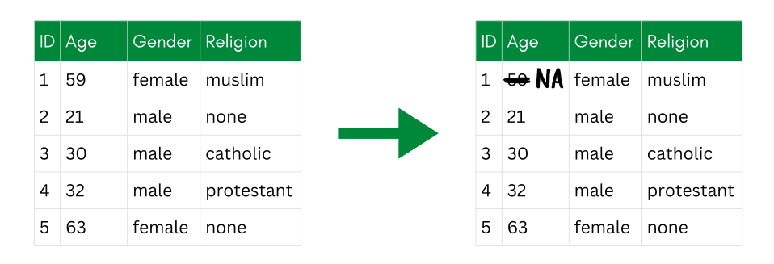
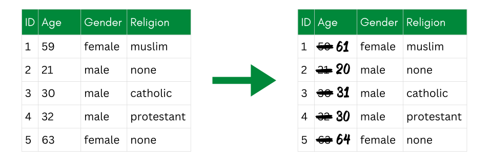
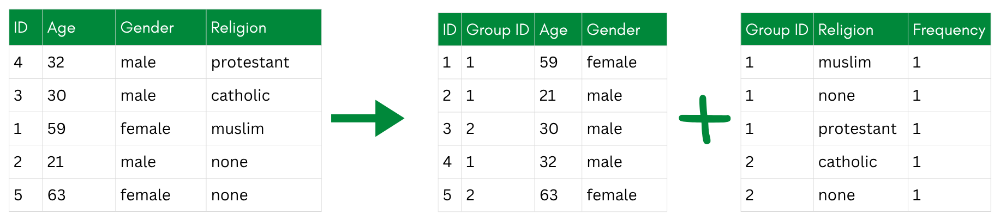
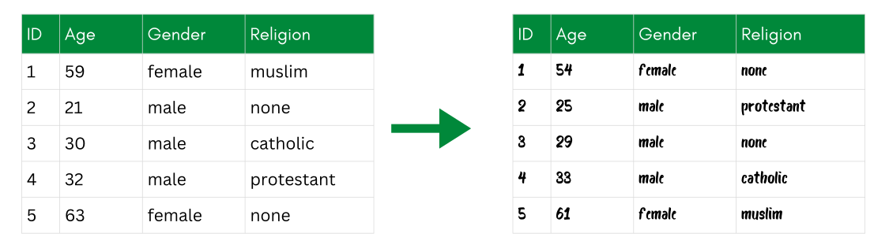

::: {.callout-tip collapse="true"}
## Learning Objective

-   After completing this part of the tutorial, you will understand the fundamental principles of anonymization techniques and how they relate to one another.
:::

Anonymization transforms data so that **individuals can no longer be identified**, while keeping the data useful for analysis. The challenge is always a trade-off: stronger anonymization means better privacy protection, but it can also mean less detailed or less useful data. Finding the right balance is the core problem we will deal with throughout this tutorial.

In the next sections of the tutorial, I will present you with several groups of techniques for anonymization, following the taxonomy by @Carvalho2023_SurveyPrivacyPreservingTechniques.

-   **Non-perturbative techniques** are those that do not change data values but rather mask them. {fig-alt="An illustration of a non-perturbative technique: a small data table in which one identifying cell has been suppressed (left blank), while the other values stay unchanged."} *An example of a non-perturbative technique (i.e., cell suppression)*

-   **Perturbative techniques** involve modifying data values to anonymize the data. {fig-alt="An illustration of a perturbative technique: a small data table in which the numeric values are altered slightly by adding random noise."} *An example of a perturbative technique (i.e., additive noise)*

-   **De-associative techniques** separate indirectly identifying parts of the data from the sensitive parts. {fig-alt="An illustration of a de-associative technique: the original table split into a quasi-identifier table (ID, Group ID, Age, Gender) and a sensitive table (Group ID, Religion, Frequency) that share only the group ID."} *An example of a de-associative technique (i.e., anatomization)*

-   **Synthesizing data** means creating new data with the same statistical properties as the original data. {fig-alt="An illustration of synthetic data: an original data table alongside a newly generated table with different records but the same statistical properties."} *An example of synthetic data*

Each family of techniques addresses different types of risk.

**Non-perturbative techniques** primarily reduce **identity disclosure** risk by making individuals less unique in the dataset—for example, by grouping age values into broader categories.

**Perturbative techniques** protect against both **identity and attribute disclosure** because they change the actual data values: Even if someone is identified, the other values may no longer be accurate.

**De-associative techniques** break the link between identifiers and sensitive attributes, making it harder to connect a person to all data within the dataset.

**Synthetic data aims to avoid disclosure risk** by generating new records based on the statistical properties of a real dataset. The records do not correspond to any real individuals but risks of statistical disclosure still needs to be assessed.

For each anonymization technique, the **variable's scale level** needs to be taken into account. Some techniques only work for categorical variables (i.e., discrete variables; e.g., gender, highest level of education), others only for continuous variables (e.g., income, age), and some work for both. Make sure to check each technique's requirements before applying it to your data.

In the following chapters, we will go through each family of techniques one by one. I will first explain the underlying idea of a family and will then provide hands-on exercises for selected techniques using **our dataset** (introduced on the [landing page](../index.qmd)) and the `sdcMicro` package. This way, you can see how each technique changes the data and its risk profile step by step.

After learning more about these techniques in the following chapters, I will explain how to decide which technique is the best for your data in the [the chapter on choosing the right technique](choosing-technique).

## Resources, Links, Examples

See @Carvalho2023_SurveyPrivacyPreservingTechniques for detailed information on these techniques.

## References
