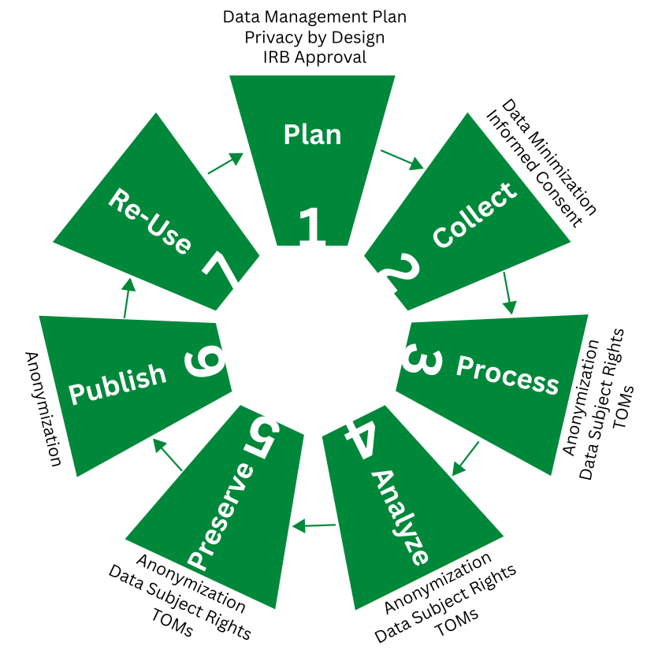

::: {.callout-tip collapse="true"}
## Learning Objectives

After completing this part of the tutorial, you will know

-   how data protection is integrated into the research process;
-   the difference between anonymization and pseudonymization.
:::

How can research protect (personal) data of participants throughout the research process? Data protection is not something that happens at a single point—it is relevant at every stage. The graph below maps common data protection mechanisms to the stages of the research lifecycle:

{fig-alt="This flow diagram shows the stages of research (plan, collect, process, analyze, preserve, publish, and re-use) with corresponding data protection measures as described in the following paragraphs."}

[*Note*. TOMs = technical and organizational measures]{style="font-size: 90%;"}

As you can see, some mechanisms (like anonymization) are relevant across many stages, while others (like informed consent) are specific to a particular point. Let's walk through each stage.

## Stage 1: Plan

### Data Management Plan

A **data management plan (DMP)** is a document that describes how you will handle your data during and after your research project. It forces you to think about data protection early. It provides answers to questions such as:

-   What data will you **collect**?
-   How will you **store** the data?
-   **Who** will have **access** to the data?
-   How will you **share** the data?

Many funders now require a DMP, and writing one is a good exercise in data minimization and purpose limitation. Also, invest some time in **enforcing** **the DMP**. Clearly **assign responsibilities** for data and its protection in case of collaboration among multiple researchers. Changes to the DMP at later stages are absolutely okay, but **keep it regularly updated**.

### Resources, Links, Examples

A useful template for a specific anonymization plan as part of a DMP is available on [Zenodo](https://zenodo.org/records/10782781).
Learn more on how to create and take advantage of DMPs in the [DMP tutorial of the OSC](https://lmu-osc.github.io/FAIR-Data-Management/dmp.html).

### Institutional Review Board (IRB) Approval

**Ethics committees or IRBs** review your study before data collection begins. Their focus is **primarily ethical**: does the study design respect participants' rights and well-being? They may also consider data protection aspects, but they are typically not technical experts in anonymization or data security. Think of IRB approval as a **necessary but not sufficient step**: it gets you started on the right track, but you still need to handle the technical side of data protection yourself.

### Privacy by Design

Privacy by Design (PbD) is a **set of principles** that require privacy protection to be **built into the design** of systems and processes from the very beginning, rather than added as an afterthought [@Cavoukian2011_PrivacyDesignLaw]. It is also enshrined as a **principle in the GDPR** (Art. 25).

For research, PbD means thinking about privacy before you start collecting data: What is the minimum data you need? How will you store it securely? When and how will you anonymize it? A detailed data management plan can be a great tool for putting PbD into practice.

::: {.callout-note collapse="false"}
## The Seven Principles of Privacy by Design [@Cavoukian2011_PrivacyDesignLaw]

PbD is primarily targeted at software products and less at research projects. Nevertheless, the principles can also guide us when designing a research study in a privacy-conscious way:

1.  **Proactive, not reactive:** Anticipate and prevent privacy risks before they occur. Don't wait for a breach to think about data protection.

2.  **Privacy as the default:** The maximum degree of privacy should be delivered automatically. If a participant or researcher takes no action, privacy should remain intact.

3.  **Privacy embedded into design:** Privacy should be an integral part of your design, not an add-on. Plan your data collection, storage, and sharing with privacy in mind from the start.

4.  **Full functionality—positive-sum, not zero-sum:** Privacy and utility are not opposites. The goal is to find approaches that serve both—enabling meaningful interactions with systems while protecting individuals.

5.  **End-to-end security:** Data should be protected throughout its entire lifecycle—from collection to deletion. This includes secure storage, encrypted transfers, and proper disposal.

6.  **Visibility and transparency:** Keep your data protection practices open and documented. Participants and oversight bodies should be able to verify that privacy is being maintained.

7.  **Respect for user privacy:** The interests of the individual should be kept central. In research, this means respecting participants' autonomy, expectations, and rights regarding their data.
:::

## Stage 2: Collect

### Informed Consent

Informed consent is both an **ethical and** (often) **a legal requirement**. Under the GDPR, consent is one possible legal basis for processing personal data (Art. 6(1)(a)). In any case, independent of the legal basis, participants have the **right to be informed** about how their data will be used at the point of collection.

In practice, informed consent in research means telling participants what data you collect, why, how it will be stored, who will have access, and whether it will be shared or published. Also, mention what rights participants have and who they can contact in case of issues. In accordance with the GDPR, it is okay to specify the purposes of data collection *broadly*, allowing participants to consent to areas of research instead of a specific purpose of one study (Recital 33). 

If you plan to anonymize and share the data, this should be stated in the consent form. A useful tutorial on writing GDPR-compliant consent forms for research is provided by @Hallinan2023_InformationProvisionInformed. It is also helpful to tell participants about the intended level of anonymization and what it means for them (e.g., plausible deniability).

Consent needs to be **freely given** (Art. 4(11)); this can be tricky in research, when mixed with a power imbalance between the researcher and participant, as it may be the case when collecting data of students or patients. In that case, consent may be invalid as a legal basis for processing of data and relying on another basis is the best way (e.g., processing in the public interest, Art. 6 (1)(e)); your institution's DPO can advise you on this. 

Consent forms are often not read or not understood, which is why consent alone is **not** a **sufficient** data protection mechanism.

### Data Minimization

Data minimization (or in German, *Datensparsamkeit*) follows a simple principle: **no data, no risk**; or more realistically: less data, less risk. The GDPR requires that you only collect data that is "adequate, relevant and limited to what is necessary" for your purpose (Art. 5(1)(c)).

In research, this means resisting the temptation to collect demographics or other variables "just in case" or "because we always do." Every additional variable you collect increases the risk of re-identification when the data is shared.

There is also a flip side to data minimization: whenever possible, **reuse existing data** instead of collecting new data. No collection is the best kind of data protection. This also aligns with the FAIR principles—making your own data findable, accessible, interoperable, and reusable reduces the need for redundant data collection and makes everybody's life easier (feel free to review the [OSC tutorial on FAIR data management](https://lmu-osc.github.io/FAIR-Data-Management/)).

::: {.callout-note collapse="false"}
### Randomized Response Technique

The randomized response technique **transparently adds privacy at the stage of data collection** [@warner1965].

To collect a sensitive attribute (e.g., abusive behavior), participants are instructed to:

-   Flip a coin.
-   If it comes up heads: answer the item "I have abused a person in the past" truthfully.
-   If it comes up tails: flip the coin again.
    -   If it comes up heads: answer "yes", regardless of the truth.
    -   If it comes up tails: answer "no", regardless of the truth.

This means that a "yes" can come **either from a person who has abused someone, or from a person who has not but was randomly assigned to answer "yes"**. Because the base rates of the coin flips are known, one can **calculate the true percentage of people who have abused someone**—**without being able to identify any individual who has done so**.

This technique requires a larger sample size to estimate prevalence and severely limits the interpretability of relations between variables, but it transparently adds privacy from the outset of data collection.

Randomized response is also an early example of what is now formalized as **differential privacy**—see the callout in [the chapter on perturbative techniques](../anonymisation-techniques/perturbative.qmd#differential-privacy).
:::

## Stages 3-6: Process, Analyze, Preserve, and Publish

### Technical and Organizational Measures (TOMs)

The GDPR requires controllers to implement "appropriate technical and organizational measures" to protect personal data (Art. 32). In a research context, this includes:

-   **Secure storage:** Keep data on encrypted drives or institutional servers with access controls, not on personal laptops or unencrypted USB sticks. At LMU Munich, for example, the [LRZ](https://www.lrz.de) provides cloud storage and sync services that keep data within Germany.
-   **Access control:** Only people who need the data for the research should **have** access. Use role-based permissions where possible.
-   **Storage limitation:** Don't keep personal data longer than necessary. Define retention periods in your data management plan and stick to them. I like to add a reminder to my calendar for dates when I need to delete data.
-   **Transfer security:** When sharing data with collaborators, use encrypted channels, not email attachments.
-   **Pseudonymization**: Replace direct identifiers (like names) with artificial identifiers (like participant codes). See below for more information.

These measures add layers of protection around your data while it is still in personal form. They do not replace anonymization, but they are essential complements.

#### Pseudonymization

Pseudonymization is the process of replacing direct identifiers (like names) with artificial identifiers (like participant codes). It is an important first step, but it is crucial to understand its limits.

The key point: **pseudonymized data is still personal data.** The GDPR explicitly states that "personal data which have undergone pseudonymisation, which could be attributed to a natural person by the use of additional information should be considered to be information on an identifiable natural person" ([GDPR Recital 26)](https://www.privacy-regulation.eu/en/recital-26-GDPR.htm). As long as a key file exists that links participant codes back to real identities—or as long as indirect identifiers in the data could allow re-identification—the data remains personal, and the GDPR fully applies.

Pseudonymized data is vulnerable to re-identification, especially through linkage attacks. This is when someone combines indirect identifiers that remain in the dataset (like age, postal code, and gender) with external information to identify individuals. We discussed this in [the chapter on personal data](personal-data), and we will look at it more formally in [the chapter on privacy concepts](privacy-concepts).

The GDPR considers pseudonymization a useful safeguard and a step in the right direction—but it is not enough if your goal is to share data openly.

For a practical, step-by-step workflow on when to remove direct identifiers and the pseudonym key across every copy of your data, see the [workflow callout in the chapter on personal data](personal-data.qmd#optimal-workflow).

### Anonymization

Anonymization goes further than pseudonymization. The goal is to **transform personal data so that individuals can no longer be identified**—directly or indirectly—by any means reasonably likely to be used. When data is truly anonymized, it falls **outside the scope of the GDPR** ([Recital 26)](https://www.privacy-regulation.eu/en/recital-26-GDPR.htm), which means it can be shared, published, and reused without the legal restrictions that apply to personal data.

This sounds straightforward, but in practice, **true anonymization is hard to achieve**. Simply removing names and email addresses is usually not enough—indirect identifiers (demographics, rare combinations of attributes, free-text responses) can still enable re-identification. This is why anonymization is not just a single step but a **process that requires careful analysis of risks and the application of specific techniques**.

The bulk of this tutorial is dedicated to teaching you these techniques and helping you assess whether your data is sufficiently anonymized for sharing. The key distinction to remember:

|   | Pseudonymization | Anonymization |
|----|----|----|
| **What?** | Replaces direct identifiers with codes | Removes or transforms data so that individuals cannot be identified |
| **Does a key file exist?** | Yes (or re-identification is otherwise possible) | No (re-identification is not reasonably possible) |
| **Is it still personal data?** | Yes | No |
| **Does GDPR apply?** | Yes | No |

Importantly, this judgement is always relative to the context of sharing; as long as any person with access can re-identify the data, it is *not* anonymous! 

### Data Subject Rights

Even during processing and analysis, participants retain their rights under the GDPR. The most relevant ones for this stage are:

-   **Right to access:** Participants can ask to see what data you hold about them. This is easier to fulfill if your data is well-organized and pseudonymized (so you can look up individual records).
-   **Right to erasure:** Participants can request that their data be deleted, for example, if they withdraw consent. Again, this requires that you can identify their records—another reason for careful pseudonymization during the active research phase.

Once data is fully anonymized, these rights no longer apply (since you can no longer identify whose data is whose). Communicate your timeline transparently to participants during participation in the study.

## Exercises

### Exercise: Anonymized, Pseudonymized, or Not Clear?

#### Scenario 1: Medical Records for Research

A hospital removes names and addresses from patient files and replaces them with random patient codes. The hospital keeps a separate file that links codes to real identities.

::: {.callout-important collapse="true"}
### Solution

**Pseudonymized**—because the re-identification key still exists.
:::

#### Scenario 2: City Council Survey

The council publishes aggregated statistics on recycling behavior, showing how many households recycle per neighborhood. No individual household identifiers are included.

::: {.callout-important collapse="true"}
### Solution

**Anonymized**—assuming big enough clusters of households, the data is aggregated and no individuals can be singled out.
:::

#### Scenario 3: Fitness Tracker Data

A company shares running and sleep data with researchers, with usernames replaced by random IDs. However, the dataset still contains exact GPS routes of daily runs.

::: {.callout-important collapse="true"}
### Solution

**Not clear**—technically pseudonymized (usernames are replaced), but GPS traces of daily routines are highly unique and might allow re-identification even without the key. This is a good example of how removing direct identifiers is not always enough.
:::

#### Scenario 4: University Exam Scores

Exam results are shared with teachers, identified only by student number. The university has the key to look up the names behind the numbers.

::: {.callout-important collapse="true"}
### Solution

**Pseudonymized**—the student number acts as a pseudonym, and the university holds the key.
:::

#### Scenario 5: Online Store Reviews

A researcher collects product reviews from an online store, removes usernames and profile links, and publishes the review texts for sentiment analysis.

::: {.callout-important collapse="true"}
### Solution

**Not clear**—identifiers have been removed, but free-text reviews may contain personal information (mentions of location, profession, or experiences) that could allow re-identification. Free text is notoriously difficult to fully anonymize.
:::

#### Scenario 6: Traffic Accident Database

A dataset on accidents contains driver age, car model, and exact location + time of each accident. Names and license plates are removed, and no key is kept.

::: {.callout-important collapse="true"}
### Solution

**Not clear / borderline anonymized**—no key exists, but the combination of rare event details (exact time, location, car model) may still allow re-identification, especially for unusual accidents that were covered by the media.
:::

#### Scenario 7: Genetic Study

DNA sequences are stored with no names but are coded with lab IDs. The original lab still keeps the mapping file.

::: {.callout-important collapse="true"}
### Solution

**Pseudonymized**—the lab can re-link the data using the mapping file. Additionally, genetic data is inherently identifying and receives special protection under Art. 9 GDPR.
:::

### Resources, Links, Examples

[Utrecht University's data privacy handbook](https://utrechtuniversity.github.io/dataprivacyhandbook/about.html) offers many insights into GDPR compliance, privacy by design, pseudonymization, data minimization, encryption, and many other topics [@researchdatamanagementsupport].
